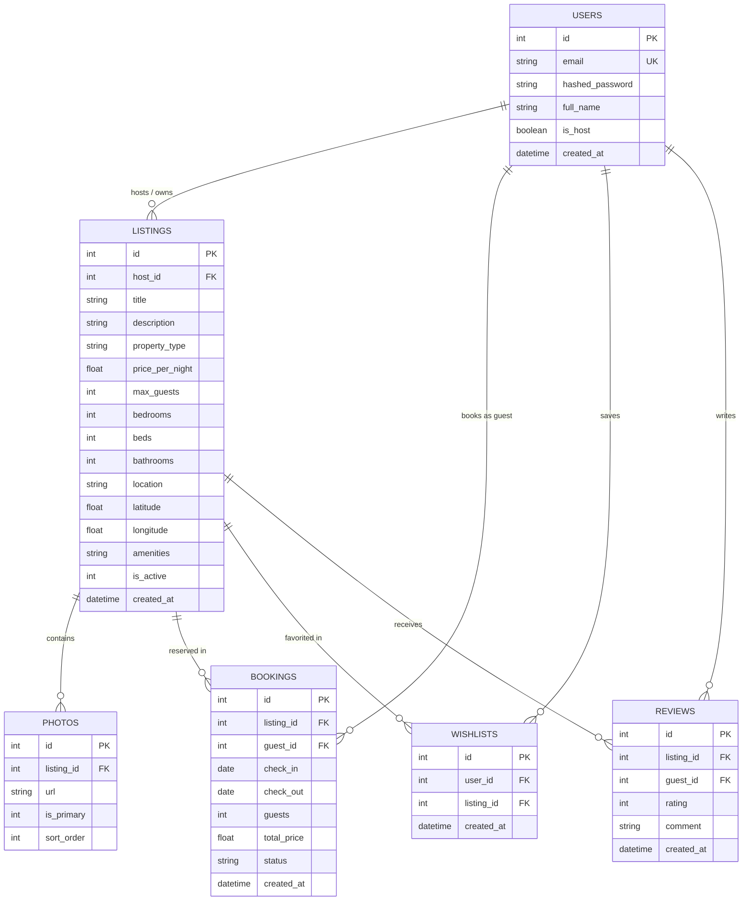

# AirClone — Full-Stack Accommodation Booking Platform

<div align="center">

[](https://air-clone-eta.vercel.app/)
[](https://nextjs.org/)
[](https://react.dev/)
[](https://fastapi.tiangolo.com/)
[](https://python.org/)
[](https://www.typescriptlang.org/)
[](https://tailwindcss.com/)
[](https://sqlite.org/)

**A production-grade, full-stack Airbnb recreation built with Next.js 16 (React 19, Turbopack, Tailwind CSS v4) and FastAPI (Python 3.11, SQLAlchemy, SQLite, JWT Bearer Auth).**

[🚀 Live Demo](https://air-clone-eta.vercel.app/) • [📋 Assignment Feature Breakdown](#-assignment-requirements--feature-breakdown) • [🗄️ Database Schema](#%EF%B8%8F-database-schema--design) • [🤔 Assumptions Made](#-assumptions-made) • [💻 Local Setup & Seeding](#-getting-started-locally)

</div>

---

## 📋 Assignment Requirements & Feature Breakdown

This application fulfills **100% of the assignment requirements**, including all **Must-Have Core Features**, **Mocked/Placeholder Sections**, **Optional Bonus Features**, and **Database/Architecture Deliverables**.

---

### 1. 🏠 Core Feature 1: Home & Search (Must Have)
* [x] **Grid of Listing Cards**:
  * Displays high-resolution multi-photo carousels with smooth arrow navigation and pagination dots.
  * Details each stay's title, location (City, State, Country), nightly rate (₹), overall guest star rating, and real-time wishlist heart toggle.
* [x] **Search Bar (Location + Date Range + Guests)**:
  * **Where (Location Autocomplete)**: Autosuggestion list with destination images and descriptions (*Noida, Goa, Manali, Mumbai, Jaipur, Wayanad, Rishikesh*).
  * **When (Interactive Date Range Picker)**: 2-month side-by-side calendar. Dates that have elapsed are automatically greyed out and marked with a **red strike-through / diagonal cut** (`line-through decoration-rose-500`) and disabled from clicking. Clicking two future dates highlights the range and updates the search bar (*e.g., "28–30 Aug"*).
  * **Who (Guest Counters)**: Interactive counters for Adults, Children, Infants, and Pets with max guest safety caps.
* [x] **Category / Filter Row**:
  * **Category Navigation**: Looping animated WebM video tabs (*Homes 🏠, Experiences 🎈, Services 🛎️*) and category pill carousels (*Amazing pools, Beachfront, Cabins, Iconic cities, Luxury havelis*).
  * **Interactive Filter Modal (`FilterModal`)**:
    * Price Range Histogram with dual Min/Max inputs (₹) and average price calculation.
    * Type of Place selector (*Any type, Entire place, Room, Shared room*).
    * Rooms & Beds selector pills for Bedrooms, Beds, and Bathrooms (`Any`, `1` to `8+`).
    * Property Type card grid (*House, Flat, Villa, Cottage, Haveli, Studio, Treehouse, Cabin, Penthouse*).
    * Categorized Amenities checklist (*Essentials, Features, Safety*).
    * Booking Options toggle switches (*Instant Book*, *Self check-in*).
* [x] **Pagination or Infinite Scroll**:
  * 4-column responsive **Discovery Grid** showing all stays across India.
  * Automated `IntersectionObserver` infinite scrolling with on/off toggle button.
  * Progressive progress bar (*"Showing X of Y stays"*), "Show more stays" manual loader, and "Show all" button.

---

### 2. 🏡 Core Feature 2: Listing Detail Page (Must Have)
* [x] **Photo Gallery**:
  * 5-photo asymmetric mosaic hero layout with subtle hover zoom.
  * Full-screen interactive **Photo Gallery Viewer Modal** with image counter.
* [x] **Title, Description, Location, Amenities, Host Info**:
  * Subtitle, expandable description section, and property specs (*Guests, Bedrooms, Beds, Bathrooms*).
  * 35+ categorized amenities popup dialog (`AmenitiesModal`).
  * Host presentation card featuring Superhost badge and **Identity Verified ✓** status.
  * Interactive Leaflet map centered on property GPS coordinates with custom price marker.
* [x] **Availability Calendar / Dynamic Date-Blocking**:
  * Live 2-month interactive side-by-side calendar connected to backend (`GET /listings/{id}/booked-dates`).
  * Dates reserved by existing confirmed reservations are struck through, greyed out, and unclickable.
  * Month navigation arrows (`<` / `>`) to browse future months.
  * Conflict warning banner (*"⚠️ Dates unavailable (already booked)"*) disabling the Reserve button on overlapping dates.
* [x] **Price Breakdown (Nightly Rate × Nights + Fees)**:
  * Dynamic calculation based on selected dates:
    $$\text{Total Price} = (\text{Price per night} \times \text{Nights}) + \text{Cleaning Fee (₹500)} + \text{AirClone Service Fee (12\%)}$$
* [x] **Reviews Section**:
  * Overall rating laurel card (*Guest Favourite 4.90★*).
  * Categorized rating metric bars (Cleanliness, Accuracy, Communication, Location, Value).
  * Verified guest reviews with reviewer avatars, dates, and comments.

---

### 3. 💳 Core Feature 3: Booking Flow (Must Have)
* [x] **Date Range & Guest Count Validation**:
  * Backend SQL query conflict protection ensures no overlapping dates can be reserved:
    ```sql
    WHERE listing_id = :id AND status = 'confirmed'
      AND check_in < :new_check_out AND check_out > :new_check_in
    ```
* [x] **Booking Summary & Mocked Checkout**:
  * Dedicated `/booking/[id]` checkout page pre-populated with URL search parameters from the listing page.
  * Displays property snapshot, cancellation policy, ground rules, and fee breakdown.
* [x] **"My Trips" Dashboard**:
  * Dedicated `/bookings` page displaying all user reservations with dates, total price, guest count, and status badges (*Confirmed*, *Completed*, *Cancelled*).
* [x] **Date Blocking Persistence**:
  * Confirmed bookings persist in SQLite and dynamically block those dates from future guest reservations.

---

### 4. 🔑 Core Feature 4: Host Experience — CRUD (Must Have)
* [x] **Create a Listing**:
  * Multi-step onboarding flow at `/become-a-host` to publish listings with title, description, category, photos via URL/multi-upload, price per night, location, max guests, bedrooms, beds, bathrooms, and amenities.
* [x] **Edit and Delete Listings**:
  * Dedicated edit page at `/listing/[id]/edit` to update listing details.
  * Soft-delete functionality directly from host profile (`DELETE /listings/{id}`).
* [x] **Host Reservations Dashboard ("Bookings on My Listings")**:
  * Dedicated tab under `/profile` displaying all guest reservations made on properties owned by the host.
  * Financial KPI metrics: Total Lifetime Earnings (₹), Total Guests Hosted, Confirmed Bookings, and Completed Trips.
  * Search filter by guest name/email and status filter (*All, Confirmed, Completed, Cancelled*).
* [x] **All Listing Data Persists**:
  * Stored in SQLite via SQLAlchemy ORM models (`listings`, `bookings`, `photos`).

---

### 5. 🎨 Core Feature 5: Airbnb Experience & Design (Must Have)
* [x] **Authentic Airbnb Look & Feel**:
  * Styled with Airbnb Cereal typography, rounded corners (`rounded-3xl`), glassmorphism headers, and Airbnb gradient brand accents (`#FF385C` to `#E00B41`).
* [x] **Cards, Galleries, Date Pickers, and Modals**:
  * `FilterModal` (Search filters), `MessagesModal` (Inbox), `WriteReviewModal` (Reviews), `LoginModal` (Auth), `PhotoGalleryModal` (Photos), `AmenitiesModal` (Amenities).
* [x] **Notifications & Toasts**:
  * Toast alerts for wishlist saves, clipboard URL copies, and review submissions.
* [x] **Wishlists & Favorites**:
  * Real-time heart button toggles synchronized with `/wishlist` API and dedicated `/wishlists` dashboard.

---

### 📦 6. Mocked / Placeholder Sections (As Specified)
* [x] **Real Payment Processing**: Mocked checkout flow on `/booking/[id]` with trip confirmation.
* [x] **Host-Guest Messaging**:
  * Direct "Messages" link in top navigation avatar menu with unread badge (`1`).
  * Opens an authentic **Host Inbox & Messaging Modal (`MessagesModal`)** with conversation threads (Goa Villa host, Noida 2BHK host, Support), real-time thread search, response rates, and message composer.
* [x] **Real-Time Map with Live Pricing Pins**:
  * Interactive Leaflet map with custom pricing pills on homepage (`SplitMapView`) and listing detail pages.
* [x] **Identity Verification**:
  * **Identity Verified ✓** badges on host cards, listing headers, and profile sidebar trust card (*Government ID verified, Email confirmed, Phone confirmed*).
* [x] **User Authentication (Guest vs Host)**:
  * JWT Bearer authentication with registration (`POST /auth/register`), login (`POST /auth/login`), and role management.

---

### 🎁 7. Bonus (Optional) Features — ALL IMPLEMENTED
* [x] **Interactive Map with Listing Pins**: Interactive Leaflet split-view with synchronized hover and click highlights.
* [x] **Leave a Review After a Completed Stay**: Interactive **Write a Review Modal** on `/bookings` with 5-star category ratings and persistent feedback badges.
* [x] **Superhost Badges & Ratings Aggregation**: Superhost laurel badges, review averages, and ratings breakdown.
* [x] **Image Upload / Multi-Photo URLs**: Multi-image gallery arrays and image upload handlers.
* [x] **Dark / Night Mode**: Seamless theme switcher (Sun ☀️ / Moon 🌙) with dark surfaces (`#121212`, `#181818`, `#242424`) and `localStorage` persistence.
* [x] **Responsive Design**: Mobile drawers, full-screen mobile search modals, tablet grids, and desktop layouts.

---

## 🗄️ Database Schema & Design

The application uses an SQLite relational database (`airclone.db`) managed through SQLAlchemy ORM models.



### Table Definitions:
1. **`users`**: Manages guest and host credentials, bcrypt hashed passwords, and host privilege flags.
2. **`listings`**: Stores property metadata, pricing, capacity, geolocation coordinates, and serialized amenities.
3. **`photos`**: Ordered gallery images associated with listings.
4. **`bookings`**: Stores reservation records, date ranges, guest counts, total calculated prices, and lifecycle status (`CONFIRMED`, `COMPLETED`, `CANCELLED`).
5. **`wishlists`**: User-saved favorite properties.
6. **`reviews`**: Verified star ratings and commentary.

---

## 🤔 Assumptions Made

1. **Currency**: All rates and calculations are in Indian Rupees (**₹ INR**).
2. **Date Granularity**: Stays are calculated per night (`check_out - check_in`). Check-out is the departure morning, meaning that date is available for a new check-in that same afternoon.
3. **Fee Structure**: Standard fee formula consists of base nightly rate $\times$ nights + ₹500 cleaning fee + 12% AirClone service fee.
4. **Authentication**: JWT tokens expire after 7 days and are stored client-side in `localStorage` with automated Axios request interceptors. Unauthenticated users can freely explore, search, filter, and view listings; attempting to book or manage listings opens the in-page Auth Modal.
5. **Payment**: Checkout is mocked for assessment purposes; clicking "Confirm & Pay" creates a verified `CONFIRMED` booking in the database.

---

## 🛠️ Technology Stack

### **Frontend**
| Technology | Version | Purpose |
| :--- | :--- | :--- |
| **Next.js** | `16.1.4` (App Router) | React Framework with Turbopack |
| **React** | `19.0.0` | UI Component Architecture |
| **TypeScript** | `5.x` | Static Type Safety |
| **Tailwind CSS** | `4.x` | Modern Utility-First Styling with Dark Mode |
| **next-themes** | `0.4.4` | Dark/Light Theme Provider & Persistence |
| **Lucide React** | Latest | Airbnb-Style Vector Icons |
| **Leaflet & React-Leaflet** | Latest | Interactive Map Visualization |
| **Axios** | Latest | Typed REST Client with Interceptors |

### **Backend**
| Technology | Version | Purpose |
| :--- | :--- | :--- |
| **FastAPI** | `0.115.x` | High-Performance Python Web Framework |
| **SQLAlchemy** | `2.x` | Relational ORM & Database Layer |
| **SQLite** | `3.x` | Embedded Relational Database (`airclone.db`) |
| **Pydantic** | `2.x` | Data Validation & Schema Contracts |
| **python-jose** | `3.3.0` | JWT Bearer Token Encryption & Decoding |
| **passlib[bcrypt]** | `1.7.4` | Cryptographic Password Hashing |
| **Uvicorn** | Latest | ASGI Web Server |

---

## 🔌 REST API Documentation

Interactive Swagger documentation is available at `http://localhost:8000/docs`.

### 🔑 Authentication (`/auth`)
| Method | Endpoint | Description | Auth Required |
| :--- | :--- | :--- | :---: |
| `POST` | `/auth/register` | Register a new user (`name`, `email`, `password`) | No |
| `POST` | `/auth/login` | Authenticate user & return JWT access token | No |
| `GET` | `/auth/me` | Retrieve authenticated user profile | Yes |
| `PATCH` | `/auth/me` | Update user profile details | Yes |

### 🏡 Listings (`/listings`)
| Method | Endpoint | Description | Auth Required |
| :--- | :--- | :--- | :---: |
| `GET` | `/listings/` | List active listings with location, price, guests, and type filters | No |
| `GET` | `/listings/{id}` | Get single listing with photos and amenities | No |
| `GET` | `/listings/{id}/booked-dates` | **Fetch confirmed booked date ranges for calendar blocking** | No |
| `POST` | `/listings/` | Create a new property listing | Yes |
| `PUT` | `/listings/{id}` | Update listing details (Owner only) | Yes |
| `DELETE` | `/listings/{id}` | Soft-delete listing (`is_active = 0`) | Yes |

### 📅 Bookings & Reservations (`/bookings`)
| Method | Endpoint | Description | Auth Required |
| :--- | :--- | :--- | :---: |
| `POST` | `/bookings/` | Validate date conflicts & create reservation | Yes |
| `GET` | `/bookings/me` | List current user's booked trips | Yes |
| `GET` | `/bookings/host-reservations` | **List all reservations on properties owned by the host** | Yes |
| `PATCH` | `/bookings/{id}/status` | Update booking status (`CONFIRMED`, `CANCELLED`) | Yes |

### ❤️ Wishlists (`/wishlist`)
| Method | Endpoint | Description | Auth Required |
| :--- | :--- | :--- | :---: |
| `GET` | `/wishlist/` | Fetch current user's saved wishlist | Yes |
| `POST` | `/wishlist/{listing_id}` | Add listing to wishlist | Yes |
| `DELETE` | `/wishlist/{listing_id}` | Remove listing from wishlist | Yes |

---

## 💻 Getting Started Locally

### Prerequisites
* **Node.js**: `v18.17+` or `v20+`
* **Python**: `v3.10+`
* **npm** or **yarn** / **pnpm**

---

### 1. Clone the Repository
```bash
git clone https://github.com/vaibhavwaliaa/AirClone.git
cd AirClone
```

---

### 2. Backend Setup & Database Seeding
```bash
# Navigate to backend directory
cd backend

# Create and activate Python virtual environment
python -m venv .venv

# On Windows (PowerShell):
.venv\Scripts\Activate.ps1
# On macOS/Linux:
# source .venv/bin/activate

# Install dependencies
pip install -r requirements.txt

# Seed database with sample hosts, listings, bookings, and reviews
python -m app.seed

# Start FastAPI development server
uvicorn app.main:app --reload --port 8000
```
> The backend server runs at `http://localhost:8000`.  
> Interactive Swagger API Docs: `http://localhost:8000/docs`.

#### 🔑 Pre-Seeded Demo Accounts
| Role | Email | Password | Pre-loaded Data |
| :--- | :--- | :--- | :--- |
| **Superhost** | `host@airclone.com` | `password123` | 4 properties across India & active guest reservations |
| **Host 2** | `host2@airclone.com` | `password123` | 3 mountain chalets & beachside villas |
| **Host 3** | `host3@airclone.com` | `password123` | 3 heritage havelis & luxury treehouses |
| **Guest 1** | `guest@airclone.com` | `password123` | Active confirmed bookings & wishlist items |
| **Guest 2** | `guest2@airclone.com` | `password123` | Past completed trip ready for review |

---

### 3. Frontend Setup
Open a new terminal window:
```bash
# Navigate to frontend directory
cd frontend

# Install Node modules
npm install

# Start Next.js Turbopack dev server
npm run dev
```
> Open [http://localhost:3000](http://localhost:3000) in your browser!

---

## 🧪 Evaluator & Testing User Flow Guide

1. **Explore & Search:**
   * Open the **Global Search Bar**: test autosuggest for "Goa" or "Noida".
   * Click **When**: observe past dates greyed out with **red strikethrough cut markings**. Select two upcoming dates.
   * Open the **Filters** button: test the Price Histogram slider, select "Entire place", and filter by "Wifi" or "Pool".
2. **Infinite Scroll & Map:**
   * Scroll down the homepage to experience the 4-column Discovery Grid with automatic infinite scrolling.
   * Click **Show map** to toggle the synchronized split map view with interactive price badges.
3. **Check Dynamic Date-Blocking:**
   * Open any listing (e.g. Listing #1): note the 2-month side-by-side availability calendar showing reserved dates struck through.
   * Select a date range to observe real-time price recalculation (Nights × Rate + Fees).
4. **Reserve & Review:**
   * Click **Reserve** to proceed through `/booking/[id]` and confirm.
   * Visit **Trips** (`/bookings`) to view the reservation and click **Write a review** to submit 5-star feedback.
5. **Host Dashboard:**
   * Log in as `host@airclone.com` and open `/profile`.
   * Switch to the **Reservations & Earnings** tab to view guest bookings, total payout metrics, and filter controls.
6. **Host Messaging:**
   * Click the avatar menu and select **Messages** to open the inbox modal with real-time thread search and message composer.

---

## 👨‍💻 Author

**Vaibhav Walia**  
* GitHub: [@vaibhavwaliaa](https://github.com/vaibhavwaliaa)  
* Project Repo: [https://github.com/vaibhavwaliaa/AirClone](https://github.com/vaibhavwaliaa/AirClone)  
* Live Production URL: [https://air-clone-eta.vercel.app/](https://air-clone-eta.vercel.app/)

---

<div align="center">
  <sub>Built with ❤️ using Next.js 16, React 19, TypeScript, Tailwind CSS v4, FastAPI, and SQLite.</sub>
</div>
