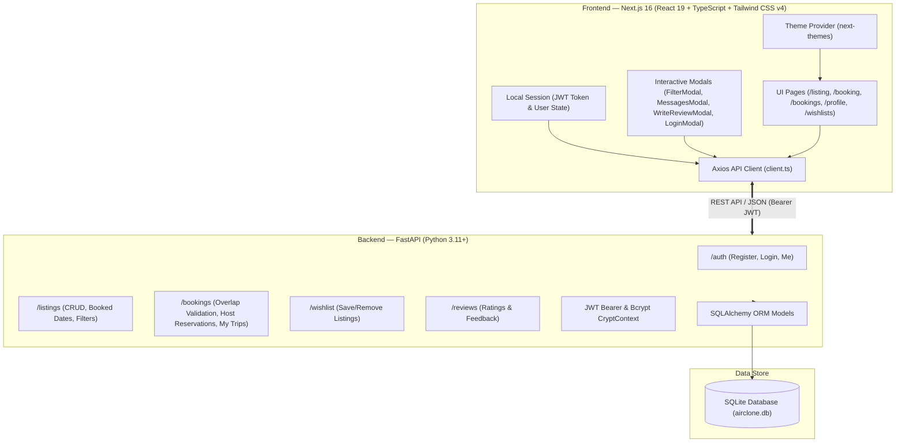
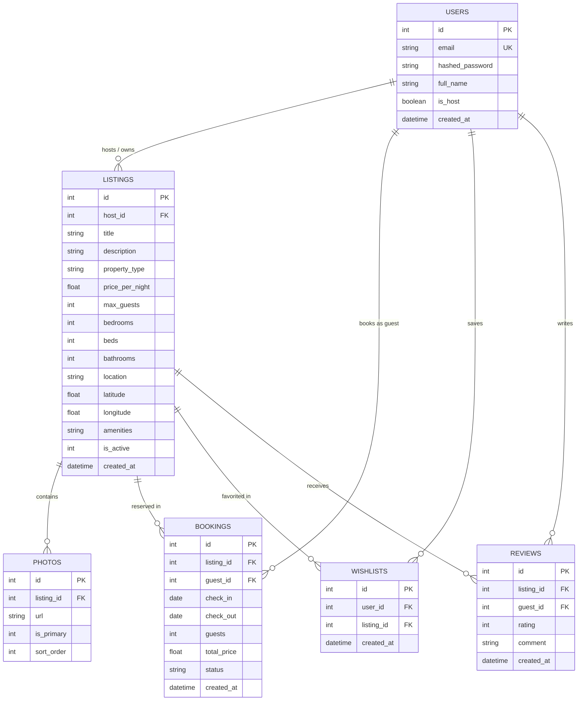

# AirClone — Full-Stack Accommodation Discovery & Booking Platform

<div align="center">

[](https://air-clone-eta.vercel.app/)
[](https://nextjs.org/)
[](https://react.dev/)
[](https://fastapi.tiangolo.com/)
[](https://python.org/)
[](https://www.typescriptlang.org/)
[](https://tailwindcss.com/)
[](https://sqlite.org/)

**A modern, production-grade Airbnb clone built with Next.js 16 (React 19, Turbopack, Tailwind CSS v4) and FastAPI (Python 3.11, SQLAlchemy, SQLite, JWT Bearer Auth).**

[🚀 Explore Live App](https://air-clone-eta.vercel.app/) • [✨ Features Matrix](#-feature-matrix--capabilities) • [🏛️ Architecture](#-system-architecture) • [🗄️ Database Schema](#%EF%B8%8F-database-schema--erd) • [🔌 API Reference](#-rest-api-documentation) • [💻 Local Setup](#-getting-started-locally)

</div>

---

## 🌟 Overview

**AirClone** is a full-stack accommodation discovery and booking web application that recreates the Airbnb experience. It combines Airbnb’s signature design language, micro-animations, and responsive layout with an end-to-end booking lifecycle, dynamic calendar date-blocking, host management dashboards, interactive search filters, and dark mode support.

### 🔗 Deployment Links
* **Production Frontend:** [https://air-clone-eta.vercel.app/](https://air-clone-eta.vercel.app/)
* **Backend API Base:** `http://localhost:8000` (or configured `NEXT_PUBLIC_API_URL`)
* **API Documentation (Swagger):** `http://localhost:8000/docs`

---

## ✨ Feature Matrix & Capabilities

| Feature Domain | Capability | Status | Implementation Details |
| :--- | :--- | :---: | :--- |
| **Home & Discovery** | Property Cards & Carousels | ✅ Live | Multi-photo carousel cards, star ratings, location, nightly rates (₹), and wishlist heart toggle |
| | Global Search Bar | ✅ Live | Destination autocomplete with rich previews, guest counters, and 2-month date picker with past date cut markings |
| | Interactive Filter Modal | ✅ Live | Price histogram slider, Type of place selector, rooms/beds pills, property type cards, and amenities checklist |
| | Infinite Scroll & Grid | ✅ Live | 4-column Discovery Grid with automatic `IntersectionObserver` infinite scrolling and progressive loader |
| **Listing Details** | Photo Gallery Viewer | ✅ Live | 5-photo asymmetric mosaic hero with full-screen interactive gallery modal |
| | Specs & Host Presentation | ✅ Live | Subtitle, expandable descriptions, 35+ amenities modal, and host card with **Identity Verified ✓** badge |
| | Dynamic Date-Blocking | ✅ Live | 2-month interactive calendar connected to backend (`GET /listings/{id}/booked-dates`) with booked date strikethroughs |
| | Dynamic Price Breakdown | ✅ Live | Nightly rate × nights + ₹500 cleaning fee + 12% service fee itemized calculation |
| | Reviews & Rating Breakdown | ✅ Live | Category rating bars (Cleanliness, Accuracy, Communication, Location, Value) + verified guest reviews |
| | Interactive Location Map | ✅ Live | Leaflet map with custom marker centered at property coordinates |
| **Booking Lifecycle** | Overlap & Capacity Validation | ✅ Live | Backend SQL overlap checks (`check_in < booking.check_out AND check_out > booking.check_in`) |
| | Checkout & Summary | ✅ Live | Pre-filled `/booking/[id]` summary with cancellation policies and trip breakdown |
| | Trips Dashboard ("My Trips") | ✅ Live | `/bookings` view with dates, guest count, pricing, status badges, and invoice view |
| | Date Persistence | ✅ Live | Confirmed bookings persist in SQLite and block future dates across the app |
| **Host Management** | Listing Creation Wizard | ✅ Live | Multi-step onboarding at `/become-a-host` with multi-photo upload, pricing, and amenities |
| | Listing Management (CRUD) | ✅ Live | Update listing details at `/listing/[id]/edit` and soft-delete listings via profile |
| | Host Reservations Dashboard | ✅ Live | Dedicated `/profile` tab with lifetime earnings (₹), guest details, status filters, and search |
| **User & Trust** | JWT Authentication | ✅ Live | In-page modal for registration (`POST /auth/register`) and login (`POST /auth/login`) with JWT Bearer tokens |
| | Identity Verification | ✅ Live | Profile sidebar trust card (*Government ID, Email, Phone verified*) and verified badges |
| | Host-Guest Messaging | ✅ Live | **Messages & Host Inbox** modal with conversation threads, real-time search, and message composer |
| | Post-Stay Reviews | ✅ Live | **Write a Review Modal** on `/bookings` with 5-star category ratings and persistent feedback |
| **UI & Experience** | Dark / Night Mode | ✅ Live | Sun ☀️ / Moon 🌙 theme toggle with dark surfaces (`#121212`, `#181818`, `#242424`) and persistence |
| | Animated Video Navigation | ✅ Live | Looping WebM video tabs for Homes 🏠, Experiences 🎈, and Services 🛎️ |
| | Responsive Layout | ✅ Live | Mobile drawers, full-screen search modals, tablet grids, and desktop layouts |
| | Database Seeding | ✅ Live | `python -m app.seed` creates 3 hosts, 2 guests, 8 diverse properties across India, bookings, and reviews |

---

## 🏛️ System Architecture



---

## 🗄️ Database Schema & ERD

The application utilizes an SQLite database (`airclone.db`) managed through SQLAlchemy ORM models.



---

## 🛠️ Technology Stack

### **Frontend**
| Technology | Version | Purpose |
| :--- | :--- | :--- |
| **Next.js** | `16.1.4` (App Router) | React Framework with Turbopack |
| **React** | `19.0.0` | UI Component Architecture |
| **TypeScript** | `5.x` | Static Type Safety |
| **Tailwind CSS** | `4.x` | Modern Styling with Custom Dark Mode Variants |
| **next-themes** | `0.4.4` | Dark/Light Theme Provider & Persistence |
| **Lucide React** | Latest | Airbnb-Style Vector Icons |
| **Leaflet & React-Leaflet** | Latest | Interactive Map Visualization |
| **Axios** | Latest | Typed REST Client with Interceptors |

### **Backend**
| Technology | Version | Purpose |
| :--- | :--- | :--- |
| **FastAPI** | `0.115.x` | High-Performance Python Web Framework |
| **SQLAlchemy** | `2.x` | Relational ORM & Database Layer |
| **SQLite** | `3.x` | Embedded Relational Database (`airclone.db`) |
| **Pydantic** | `2.x` | Data Validation & Schema Contracts |
| **python-jose** | `3.3.0` | JWT Bearer Token Encryption & Decoding |
| **passlib[bcrypt]** | `1.7.4` | Cryptographic Password Hashing |
| **Uvicorn** | Latest | ASGI Web Server |

---

## 🔌 REST API Documentation

Interactive Swagger documentation is available at `http://localhost:8000/docs`.

### 🔑 Authentication (`/auth`)
| Method | Endpoint | Description | Auth Required |
| :--- | :--- | :--- | :---: |
| `POST` | `/auth/register` | Register a new user (`name`, `email`, `password`) | No |
| `POST` | `/auth/login` | Authenticate user & return JWT access token | No |
| `GET` | `/auth/me` | Retrieve authenticated user profile | Yes |
| `PATCH` | `/auth/me` | Update user profile details | Yes |

### 🏡 Listings (`/listings`)
| Method | Endpoint | Description | Auth Required |
| :--- | :--- | :--- | :---: |
| `GET` | `/listings/` | List active listings with location, price, guests, and type filters | No |
| `GET` | `/listings/{id}` | Get single listing with photos and amenities | No |
| `GET` | `/listings/{id}/booked-dates` | Fetch confirmed booked date ranges for calendar blocking | No |
| `POST` | `/listings/` | Create a new property listing | Yes |
| `PUT` | `/listings/{id}` | Update listing details (Owner only) | Yes |
| `DELETE` | `/listings/{id}` | Soft-delete listing (`is_active = 0`) | Yes |

### 📅 Bookings & Reservations (`/bookings`)
| Method | Endpoint | Description | Auth Required |
| :--- | :--- | :--- | :---: |
| `POST` | `/bookings/` | Validate date conflicts & create reservation | Yes |
| `GET` | `/bookings/me` | List current user's booked trips | Yes |
| `GET` | `/bookings/host-reservations` | List all reservations on properties owned by the host | Yes |
| `PATCH` | `/bookings/{id}/status` | Update booking status (`CONFIRMED`, `CANCELLED`) | Yes |

### ❤️ Wishlists (`/wishlist`)
| Method | Endpoint | Description | Auth Required |
| :--- | :--- | :--- | :---: |
| `GET` | `/wishlist/` | Fetch current user's saved wishlist | Yes |
| `POST` | `/wishlist/{listing_id}` | Add listing to wishlist | Yes |
| `DELETE` | `/wishlist/{listing_id}` | Remove listing from wishlist | Yes |

---

## 💻 Getting Started Locally

### Prerequisites
* **Node.js**: `v18.17+` or `v20+`
* **Python**: `v3.10+`
* **npm** or **yarn** / **pnpm**

---

### 1. Clone the Repository
```bash
git clone https://github.com/vaibhavwaliaa/AirClone.git
cd AirClone
```

---

### 2. Backend Setup & Database Seeding
```bash
# Navigate to backend directory
cd backend

# Create and activate Python virtual environment
python -m venv .venv

# On Windows (PowerShell):
.venv\Scripts\Activate.ps1
# On macOS/Linux:
# source .venv/bin/activate

# Install dependencies
pip install -r requirements.txt

# Seed database with sample hosts, listings, bookings, and reviews
python -m app.seed

# Start FastAPI development server
uvicorn app.main:app --reload --port 8000
```
> The backend server runs at `http://localhost:8000`.  
> Interactive Swagger API Docs: `http://localhost:8000/docs`.

#### 🔑 Pre-Seeded Demo Accounts
| Role | Email | Password | Pre-loaded Data |
| :--- | :--- | :--- | :--- |
| **Superhost** | `host@airclone.com` | `password123` | 4 properties across India & active guest reservations |
| **Host 2** | `host2@airclone.com` | `password123` | 3 mountain chalets & beachside villas |
| **Host 3** | `host3@airclone.com` | `password123` | 3 heritage havelis & luxury treehouses |
| **Guest 1** | `guest@airclone.com` | `password123` | Active confirmed bookings & wishlist items |
| **Guest 2** | `guest2@airclone.com` | `password123` | Past completed trip ready for review |

---

### 3. Frontend Setup
Open a new terminal window:
```bash
# Navigate to frontend directory
cd frontend

# Install Node modules
npm install

# Start Next.js Turbopack dev server
npm run dev
```
> Open [http://localhost:3000](http://localhost:3000) in your browser!

---

## 🧪 Testing the Complete User Flow

1. **Explore & Search:**
   * Open the **Global Search Bar**: test autosuggest for "Goa" or "Noida".
   * Click **When**: observe past dates greyed out with **red strikethrough cut markings**. Select two upcoming dates.
   * Open the **Filters** button: test the Price Histogram slider, select "Entire place", and filter by "Wifi" or "Pool".
2. **Infinite Scroll & Map:**
   * Scroll down the homepage to experience the 4-column Discovery Grid with automatic infinite scrolling.
   * Click **Show map** to toggle the synchronized split map view with interactive price badges.
3. **Check Dynamic Date-Blocking:**
   * Open any listing (e.g. Listing #1): note the 2-month side-by-side availability calendar showing reserved dates struck through.
   * Select a date range to observe real-time price recalculation (Nights × Rate + Fees).
4. **Reserve & Review:**
   * Click **Reserve** to proceed through `/booking/[id]` and confirm.
   * Visit **Trips** (`/bookings`) to view the reservation and click **Write a review** to submit 5-star feedback.
5. **Host Dashboard:**
   * Log in as `host@airclone.com` and open `/profile`.
   * Switch to the **Reservations & Earnings** tab to view guest bookings, total payout metrics, and filter controls.
6. **Host Messaging:**
   * Click the avatar menu and select **Messages** to open the inbox modal with real-time thread search and message composer.

---

## 👨‍💻 Author

**Vaibhav Walia**  
* GitHub: [@vaibhavwaliaa](https://github.com/vaibhavwaliaa)  
* Project Repo: [https://github.com/vaibhavwaliaa/AirClone](https://github.com/vaibhavwaliaa/AirClone)  
* Live Production URL: [https://air-clone-eta.vercel.app/](https://air-clone-eta.vercel.app/)

---

<div align="center">
  <sub>Built with ❤️ using Next.js 16, React 19, TypeScript, Tailwind CSS v4, FastAPI, and SQLite.</sub>
</div>
