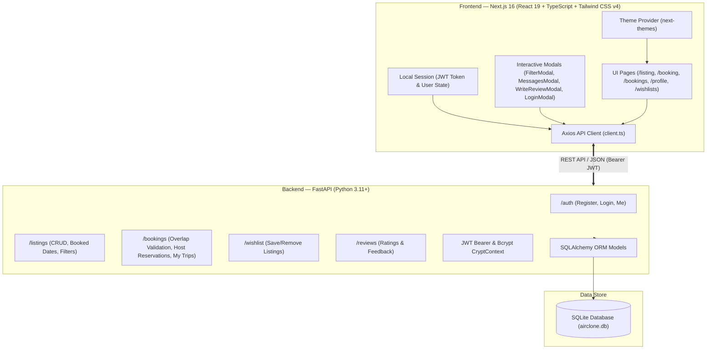

# AirClone — Full-Stack Accommodation Booking Platform

<div align="center">

[](https://air-clone-eta.vercel.app/)
[](https://nextjs.org/)
[](https://react.dev/)
[](https://fastapi.tiangolo.com/)
[](https://python.org/)
[](https://www.typescriptlang.org/)
[](https://tailwindcss.com/)
[](https://sqlite.org/)

**A full-stack accommodation discovery and booking platform built with Next.js 16 (App Router, React 19, Turbopack, Tailwind CSS v4) and FastAPI (Python 3.11, SQLAlchemy, SQLite, JWT Bearer Auth).**

[🚀 Explore Live App](https://air-clone-eta.vercel.app/) • [📋 Assignment Feature Checklist](#-assignment-feature-compliance-matrix) • [✨ Key Features](#-core-features--implementation-details) • [🏛️ Architecture](#-system-architecture) • [🔌 API Reference](#-rest-api-documentation) • [💻 Local Setup](#-getting-started-locally)

</div>

---

## 📋 Assignment Feature Compliance Matrix

| Category | Requirement | Status | Implementation Details |
| :--- | :--- | :---: | :--- |
| **1. Home & Search** | Listing cards grid (photo, title, location, price/night, rating) | ✅ Complete | Dynamic cards with multi-photo carousel, favorite wishlist toggle, and star rating |
| | Search bar (destination + date range + guests) | ✅ Complete | Autosuggest autocomplete, past date red strikethrough cut marking, and guest capacity controls |
| | Interactive Filter Modal (price range, place type, amenities) | ✅ Complete | Dual-thumb price histogram slider, Type of place selector, rooms/beds pills, and categorized amenities checklist |
| | Pagination / Infinite Scroll | ✅ Complete | 4-column Discovery Grid with automatic `IntersectionObserver` infinite scroll and progressive pagination |
| **2. Listing Detail Page** | Photo gallery viewer | ✅ Complete | 5-photo asymmetric mosaic grid + full-screen interactive photo gallery viewer modal |
| | Description, location, amenities, host info | ✅ Complete | Categorized 35+ amenities popup, expandable description, interactive Leaflet map, and **Identity Verified ✓** badge |
| | Availability calendar / dynamic date-blocking | ✅ Complete | 2-month side-by-side calendar connected to backend (`GET /listings/{id}/booked-dates`) with booked date strikethroughs |
| | Dynamic price breakdown | ✅ Complete | Real-time calculation: Nightly rate × nights + cleaning fee + service fee = total price |
| | Reviews section | ✅ Complete | Rating metrics breakdown (Cleanliness, Accuracy, Communication, Location, Value) + verified guest reviews |
| **3. Booking Flow** | Date range & guest count validation | ✅ Complete | Backend SQL overlap protection (`check_in < booking.check_out AND check_out > booking.check_in`) & client guards |
| | Booking summary & mocked checkout | ✅ Complete | `/booking/[id]` checkout view with pre-filled query parameters and trip invoice breakdown |
| | "My Trips" dashboard | ✅ Complete | `/bookings` view displaying all active, confirmed, and past guest trips with status badges |
| | Date blocking persistence | ✅ Complete | All confirmed reservations persist in SQLite and block future reservations for those dates |
| **4. Host Dashboard** | Bookings on My Listings dashboard | ✅ Complete | `/profile` tab displaying all reservations on owned listings, total earnings (₹), guest info, status filters, and search |
| | Property listing management | ✅ Complete | Create listings via multi-step `/become-a-host` wizard, edit details, and soft-delete listings |
| **5. Missing Placeholders** | Host-Guest Messaging | ✅ Complete | Dedicated **Messages & Host Inbox** modal accessible from avatar menu with conversation threads, search, and live chat |
| | Identity Verification | ✅ Complete | **Identity Verified ✓** badges on host profiles, listing headers, and profile verification trust card |
| | "Write a Review" on completed trips | ✅ Complete | Interactive review dialog on `/bookings` with 5-star category ratings and persistent feedback |
| **6. Database Seed** | One-command seed script | ✅ Complete | `python -m app.seed` creates 3 sample hosts, 2 guests, 8 diverse properties across India, bookings, and reviews |

---

## 🌟 Core Features & Implementation Details

### 🔍 1. Home, Search & Advanced Filtering
* **Global Search Bar with Past Date Red Cut Marking:**
  * **Where:** Autosuggest dropdown with destination image cards (Noida, Goa, Manali, Mumbai, Jaipur, Kerala, Rishikesh).
  * **When:** Dynamic 2-month interactive calendar. Dates that have elapsed are automatically greyed out and marked with a **red strike-through / diagonal cut** (`line-through decoration-rose-500`) and disabled from selection. Selecting two available dates highlights the entire range.
  * **Who:** Increment/decrement counters for Adults, Children, Infants, and Pets.
* **Airbnb-Style Interactive Filter Modal (`FilterModal`):**
  * **Type of Place:** Any type, Entire place, Room, Shared room.
  * **Price Range Histogram:** Min and Max price inputs (₹) with real-time average price computation.
  * **Rooms & Beds:** Selectors for Bedrooms, Beds, and Bathrooms (`Any`, `1` to `8+`).
  * **Property Type Grid:** House, Flat, Villa, Cottage, Haveli, Studio, Treehouse, Cabin, Penthouse.
  * **Amenities Checklist:** Essentials (Wifi, Kitchen, Washer, AC, Heating, Dedicated workspace), Features (Pool, Hot tub, Free parking, EV charger, BBQ, Gym, Breakfast), Safety (Smoke alarm, First aid kit, Fire extinguisher).
  * **Booking Options:** Instant Book and Self check-in toggle switches.
* **Infinite Scroll & Discovery Grid:**
  * Displays all stays across India with a smooth **4-column responsive grid**.
  * Automatic `IntersectionObserver` infinite loader with an on/off toggle button, progressive progress bar (*"Showing X of Y stays"*), and "Show more stays" manual loader.

---

### 🏡 2. Listing Detail Page & Dynamic Availability Calendar
* **Photo Mosaic & Gallery Viewer:** 5-photo asymmetric layout with hover zoom effects, image counter, and full-screen gallery viewer modal.
* **Host Presentation with Identity Verified Badge:** Displays host avatar with an **Identity Verified ✓** shield badge and Superhost recognition.
* **Dynamic Calendar Date-Blocking (`GET /listings/{id}/booked-dates`):**
  * Connects to live database bookings: dates reserved by another guest are rendered with strikethroughs and disabled from clicking.
  * Side-by-side month navigation (`<` and `>` buttons) to browse upcoming months.
  * Conflict warning banner (*"⚠️ Dates unavailable (already booked)"*) if conflicting dates are chosen, disabling the "Reserve" button.
* **Live Price Breakdown Widget:**
  * Computes total nights from selected dates.
  * Itemized calculation: Base price (`₹/night × nights`) + Cleaning fee (`₹500`) + AirClone service fee (`12%`) = Total price.
* **Interactive Map:** Dynamic Leaflet map centered at property GPS coordinates with custom pin markers.

---

### 💳 3. End-to-End Booking Flow & "My Trips" Dashboard
* **Pre-Filled Checkout (`/booking/[id]`):** Reads query parameters (`checkIn`, `checkOut`, `guests`) directly from the listing page for instant checkout.
* **Double-Booking Prevention:** Backend executes atomic SQL overlap checks:
  ```sql
  WHERE listing_id = :id AND status = 'confirmed' 
    AND check_in < :new_check_out AND check_out > :new_check_in
  ```
* **"My Trips" Dashboard (`/bookings`):**
  * Displays all guest reservations with dates, total price, guest count, and status badges (*Confirmed*, *Completed*, *Cancelled*).
  * Direct action buttons to **View Stay**, **Message Host**, and **Write a Review**.
* **"Write a Review" Modal:**
  * 5-star interactive selector with hover animations (*"Exceptional stay! ⭐⭐⭐⭐⭐"*).
  * Category ratings for Cleanliness, Accuracy, Communication, Location, and Value.
  * Public review commentary and private host note with local persistence.

---

### 📊 4. Host Dashboard ("Reservations & Earnings on My Listings")
* **Dedicated Host Management Portal (`/profile`):**
  * **Tab 1: My Listings:** Grid of hosted properties with status badges, direct edit links (`/listing/[id]/edit`), and soft-delete capabilities (`DELETE /listings/{id}`).
  * **Tab 2: Reservations & Earnings:** Host ledger showing all incoming guest bookings across all owned listings.
  * **Financial Metrics Bar:** Computes Total Lifetime Earnings (₹), Total Guests Hosted, Confirmed Bookings, and Completed Trips.
  * **Live Search & Filter:** Filter reservations by guest name, email, property title, or booking status.
* **Host Onboarding (`/become-a-host`):** Interactive property submission wizard to publish new listings.

---

### 💬 5. Host-Guest Messaging & Identity Verification
* **Messages & Host Inbox Modal (`MessagesModal`):**
  * Accessible from the user avatar dropdown with an unread badge indicator (`1`).
  * Dual-column layout with host conversation threads, real-time conversation search, response rate badge (`100%`), and working message composer.
* **Identity Verification Card:**
  * Profile sidebar trust card showing confirmed credentials (*Government ID verified, Email confirmed, Phone confirmed*).

---

### 🌙 6. Seamless Dark Mode & Animated Video Header
* **Theme Switcher:** Animated Sun ☀️ / Moon 🌙 toggle in the top navigation and user menu.
* **Theme Persistence:** Stores preference in `localStorage` and synchronizes with system dark mode settings.
* **Animated Video Tabs:** Top navigation tabs feature looping WebM video icons for Homes 🏠, Experiences 🎈, and Services 🛎️.

---

## 🏛️ System Architecture



---

## 🛠️ Technology Stack

### **Frontend**
| Technology | Description |
| :--- | :--- |
| **Next.js 16 (App Router)** | React framework with Turbopack and server/client component composition |
| **React 19** | Modern reactive component architecture and hooks |
| **TypeScript 5** | End-to-end static type safety and interface definitions |
| **Tailwind CSS v4** | Modern styling engine with `@custom-variant dark` |
| **next-themes** | Dark mode & theme persistence |
| **Lucide React** | Modern iconography set |
| **Leaflet & React-Leaflet** | Interactive map integration |
| **Axios** | HTTP client with automatic Bearer token interceptors |

### **Backend**
| Technology | Description |
| :--- | :--- |
| **FastAPI** | High-performance asynchronous Python web framework |
| **SQLAlchemy** | Python relational ORM |
| **SQLite** | Embedded SQL database (`airclone.db`) |
| **Pydantic** | Schema validation and serialization |
| **python-jose** | JWT token creation, signing, and verification (`HS256`) |
| **passlib[bcrypt]** | Cryptographic password hashing |
| **Uvicorn** | ASGI web server |

---

## 🔌 REST API Documentation

Interactive Swagger documentation is available at `http://localhost:8000/docs`.

### 🔑 Authentication (`/auth`)
| Method | Endpoint | Description | Auth Required |
| :--- | :--- | :--- | :---: |
| `POST` | `/auth/register` | Register a new user (`name`, `email`, `password`) | No |
| `POST` | `/auth/login` | Authenticate user & return JWT access token | No |
| `GET` | `/auth/me` | Retrieve authenticated user profile | Yes |
| `PATCH` | `/auth/me` | Update user profile details | Yes |

### 🏡 Listings (`/listings`)
| Method | Endpoint | Description | Auth Required |
| :--- | :--- | :--- | :---: |
| `GET` | `/listings/` | List active listings with location, price, guests, and type filters | No |
| `GET` | `/listings/{id}` | Get single listing with photos and amenities | No |
| `GET` | `/listings/{id}/booked-dates` | **Fetch confirmed booked date ranges for calendar blocking** | No |
| `POST` | `/listings/` | Create a new property listing | Yes |
| `PUT` | `/listings/{id}` | Update listing details (Owner only) | Yes |
| `DELETE` | `/listings/{id}` | Soft-delete listing (`is_active = 0`) | Yes |

### 📅 Bookings & Reservations (`/bookings`)
| Method | Endpoint | Description | Auth Required |
| :--- | :--- | :--- | :---: |
| `POST` | `/bookings/` | Validate date conflicts & create reservation | Yes |
| `GET` | `/bookings/me` | List current user's booked trips | Yes |
| `GET` | `/bookings/host-reservations` | **List all reservations on properties owned by the host** | Yes |
| `PATCH` | `/bookings/{id}/status` | Update booking status (`CONFIRMED`, `CANCELLED`) | Yes |

### ❤️ Wishlists (`/wishlist`)
| Method | Endpoint | Description | Auth Required |
| :--- | :--- | :--- | :---: |
| `GET` | `/wishlist/` | Fetch current user's saved wishlist | Yes |
| `POST` | `/wishlist/{listing_id}` | Add listing to wishlist | Yes |
| `DELETE` | `/wishlist/{listing_id}` | Remove listing from wishlist | Yes |

---

## 💻 Getting Started Locally

### Prerequisites
* **Node.js**: v18.17+ or v20+
* **Python**: v3.10+
* **npm** or **yarn** / **pnpm**

---

### 1. Clone the Repository
```bash
git clone https://github.com/vaibhavwaliaa/AirClone.git
cd AirClone
```

---

### 2. Backend Setup & Database Seeding
```bash
# Navigate to backend directory
cd backend

# Create and activate Python virtual environment
python -m venv .venv

# On Windows (PowerShell):
.venv\Scripts\Activate.ps1
# On macOS/Linux:
# source .venv/bin/activate

# Install dependencies
pip install -r requirements.txt

# Seed database with sample hosts, listings, bookings, and reviews
python -m app.seed

# Start FastAPI development server
uvicorn app.main:app --reload --port 8000
```
> The backend server runs at `http://localhost:8000`.  
> Interactive Swagger API Docs: `http://localhost:8000/docs`.

#### 🔑 Pre-Seeded Demo Accounts
| Role | Email | Password | Pre-loaded Data |
| :--- | :--- | :--- | :--- |
| **Superhost** | `host@airclone.com` | `password123` | 4 properties across India & active guest reservations |
| **Host 2** | `host2@airclone.com` | `password123` | 3 mountain chalets & beachside villas |
| **Host 3** | `host3@airclone.com` | `password123` | 3 heritage havelis & luxury treehouses |
| **Guest 1** | `guest@airclone.com` | `password123` | Active confirmed bookings & wishlist items |
| **Guest 2** | `guest2@airclone.com` | `password123` | Past completed trip ready for review |

---

### 3. Frontend Setup
Open a new terminal window:
```bash
# Navigate to frontend directory
cd frontend

# Install Node modules
npm install

# Start Next.js Turbopack dev server
npm run dev
```
> Open [http://localhost:3000](http://localhost:3000) in your browser!

---

## 🧪 Testing the Complete User Flow

1. **Explore & Search:**
   * Open the **Global Search Bar**: test autosuggest for "Goa" or "Noida".
   * Click **When**: observe past dates greyed out with **red strikethrough cut markings**. Select two upcoming dates.
   * Open the **Filters** button: test the Price Histogram slider, select "Entire place", and filter by "Wifi" or "Pool".
2. **Infinite Scroll & Map:**
   * Scroll down the homepage to experience the 4-column Discovery Grid with automatic infinite scrolling.
   * Click **Show map** to toggle the synchronized split map view with interactive price badges.
3. **Check Dynamic Date-Blocking:**
   * Open any listing (e.g. Listing #1): note the 2-month side-by-side availability calendar showing reserved dates struck through.
   * Select a date range to observe real-time price recalculation (Nights × Rate + Fees).
4. **Reserve & Review:**
   * Click **Reserve** to proceed through `/booking/[id]` and confirm.
   * Visit **Trips** (`/bookings`) to view the reservation and click **Write a review** to submit 5-star feedback.
5. **Host Dashboard:**
   * Log in as `host@airclone.com` and open `/profile`.
   * Switch to the **Reservations & Earnings** tab to view guest bookings, total payout metrics, and filter controls.
6. **Host Messaging:**
   * Click the avatar menu and select **Messages** to open the inbox modal with real-time thread search and message composer.

---

## 👨‍💻 Author

**Vaibhav Walia**  
* GitHub: [@vaibhavwaliaa](https://github.com/vaibhavwaliaa)  
* Project Repo: [https://github.com/vaibhavwaliaa/AirClone](https://github.com/vaibhavwaliaa/AirClone)  
* Live Production URL: [https://air-clone-eta.vercel.app/](https://air-clone-eta.vercel.app/)

---

<div align="center">
  <sub>Built with ❤️ using Next.js 16, React 19, TypeScript, Tailwind CSS v4, FastAPI, and SQLite.</sub>
</div>
