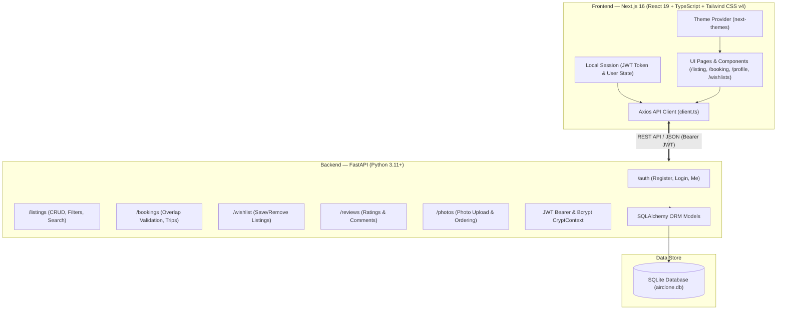

# AirClone — Full-Stack Accommodation Booking Platform

<div align="center">

[](https://air-clone-eta.vercel.app/)
[](https://nextjs.org/)
[](https://react.dev/)
[](https://fastapi.tiangolo.com/)
[](https://python.org/)
[](https://www.typescriptlang.org/)
[](https://tailwindcss.com/)
[](https://sqlite.org/)

**A full-stack accommodation discovery and reservation platform built with a high-performance Next.js 16 frontend and a robust FastAPI backend.**

[🚀 Explore Live App](https://air-clone-eta.vercel.app/) • [✨ Features](#-key-features) • [🏛️ Architecture](#-system-architecture) • [🔌 API Reference](#-rest-api-documentation) • [💻 Local Setup](#-getting-started-locally)

</div>

---

## 🌟 Overview

**AirClone** is a modern accommodation discovery and booking web application. It combines Airbnb’s signature design language and micro-interactions with an end-to-end booking lifecycle, robust JWT authentication, user registration, property management, and dynamic dark mode support.

### 🔗 Deployment Links
* **Production Frontend:** [https://air-clone-eta.vercel.app/](https://air-clone-eta.vercel.app/)
* **Backend API Base:** `http://localhost:8000` (or configured `NEXT_PUBLIC_API_URL`)
* **API Documentation (Swagger):** `http://localhost:8000/docs`

---

## ✨ Key Features

### 🌙 1. Dark / Night Mode Support
* **Seamless Theme Toggling:** Easily switch between Light and Dark themes via the animated Sun ☀️ / Moon 🌙 toggle in the top header and inside the user menu.
* **Persistent Preferences:** Automatically saves user theme preference in `localStorage` and synchronizes with system color scheme (`prefers-color-scheme`).
* **Complete Dark Palette:** Carefully crafted dark surfaces (`#121212`, `#181818`, `#1e1e1e`, `#242424`) with smooth transitions across headers, inputs, cards, search dialogs, and modals.

### 🔐 2. Complete Authentication & User Registration
* **Interactive Dual-Mode Auth Modal:** Toggle between **Sign Up** (Registration) and **Log In** with one click.
* **Instant Account Creation:** Seamlessly registers new users (`POST /auth/register`) with full name, email, and password, then automatically establishes session tokens for instant sign-in.
* **Secure Token Handling:** JWT Bearer authentication (`python-jose`) with bcrypt password hashing (`passlib`) stored in `localStorage` with automated Axios request/response interceptors.
* **Dedicated Standalone Pages:** Full `/login` and `/register` fallback routes for direct URL navigation.

### 🎥 3. Animated Video Navigation Header
* **Interactive Media Tabs:** Header features looping WebM animated video icons:
  * 🏠 **Homes:** `/videos/house.webm`
  * 🎈 **Experiences:** `/videos/balloon.webm`
  * 🛎️ **Services:** `/videos/consierge.webm`
* **Adaptive Sticky Header:** Smoothly expands into full search mode at the top and collapses into a compact floating pill on scroll.

### 🔍 4. Interactive Search Bar
* **Where (Destinations):** Autosuggestion list with icons, image previews, and landmark descriptions.
* **When (Dates):** Interactive calendar with Exact Dates, Month Picker, and Flexible day ranges (± 1, 2, 3, 7, 14 days).
* **Who (Guests):** Increment/decrement counters for Adults, Children, Infants, and Pets with capacity safeguards.

### 📅 5. End-to-End Reservation System
* **Live Availability Validation:** Backend queries check for date overlaps (`check_in < booking.check_out AND check_out > booking.check_in`) to prevent double bookings.
* **Dynamic Pricing Engine:** Calculates total nights, taxes, fees, and final price breakdown.
* **Trips Dashboard:** Dedicated `/bookings` page ("My Trips") displaying active and confirmed reservations.

### 👤 6. User Profile & Host Listing Management
* **Profile Customization:** Edit and update name and email (`PATCH /auth/me`).
* **Host Onboarding:** Multi-step wizard under `/become-a-host` to create and list properties.
* **Listing Management:** Hosts can view, edit details, and soft-delete listings directly from their profile.

### ❤️ 7. Wishlists & Favorites
* Real-time heart toggles on property cards synchronized with backend wishlist endpoints (`/wishlist/`).
* Dedicated `/wishlists` dashboard displaying all saved properties.

---

## 🏛️ System Architecture



---

## 🛠️ Technology Stack

### **Frontend**
| Technology | Description |
| :--- | :--- |
| **Next.js 16 (App Router)** | React framework with Turbopack and server-client composition |
| **React 19** | Modern reactive component architecture |
| **TypeScript 5** | End-to-end static type safety and interfaces |
| **Tailwind CSS v4** | Modern utility-first styling with `@custom-variant dark` |
| **next-themes** | Dark mode & theme persistence |
| **Lucide React** | Clean, modern iconography |
| **Axios** | HTTP client with request/response Bearer token interceptors |

### **Backend**
| Technology | Description |
| :--- | :--- |
| **FastAPI** | High-performance asynchronous Python web framework |
| **SQLAlchemy** | Relational ORM for Python |
| **SQLite** | Embedded SQL database engine (`airclone.db`) |
| **Pydantic** | Data validation and schema parsing |
| **python-jose** | JWT token creation, signing, and decoding (`HS256`) |
| **passlib[bcrypt]** | Industrial-grade cryptographic password hashing |
| **Uvicorn** | Lightning-fast ASGI web server |

---

## 🔌 REST API Documentation

The backend provides comprehensive REST endpoints with interactive Swagger UI available at `http://localhost:8000/docs`.

### 🔑 Authentication (`/auth`)
| Method | Endpoint | Description | Auth Required |
| :--- | :--- | :--- | :---: |
| `POST` | `/auth/register` | Register a new user (`name`, `email`, `password`) | No |
| `POST` | `/auth/login` | Authenticate user & return JWT token | No |
| `GET` | `/auth/me` | Retrieve authenticated user profile | Yes |
| `PATCH` | `/auth/me` | Update user profile details | Yes |

### 🏡 Listings (`/listings`)
| Method | Endpoint | Description | Auth Required |
| :--- | :--- | :--- | :---: |
| `GET` | `/listings/` | List active listings with location, price, guests filters | No |
| `GET` | `/listings/{id}` | Get single listing with ordered photo gallery | No |
| `POST` | `/listings/` | Create a new property listing | Yes |
| `PUT` | `/listings/{id}` | Update listing details (Owner only) | Yes |
| `DELETE` | `/listings/{id}` | Soft-delete listing (`is_active = 0`) | Yes |

### 📅 Bookings (`/bookings`)
| Method | Endpoint | Description | Auth Required |
| :--- | :--- | :--- | :---: |
| `POST` | `/bookings/` | Validate capacity/dates & create reservation | Yes |
| `GET` | `/bookings/me` | List current user's reservations | Yes |

### ❤️ Wishlist (`/wishlist`)
| Method | Endpoint | Description | Auth Required |
| :--- | :--- | :--- | :---: |
| `GET` | `/wishlist/` | Fetch current user's saved wishlist | Yes |
| `POST` | `/wishlist/{listing_id}` | Add listing to wishlist | Yes |
| `DELETE` | `/wishlist/{listing_id}` | Remove listing from wishlist | Yes |

---

## 📁 Repository Structure

```text
AirClone/
├── backend/
│   ├── app/
│   │   ├── models/            # SQLAlchemy database entities (User, Listing, Booking, etc.)
│   │   ├── routers/           # FastAPI routes (auth, listings, bookings, wishlist, reviews, photos)
│   │   ├── schemas/           # Pydantic validation schemas
│   │   ├── database.py        # Database session and engine setup
│   │   ├── main.py            # FastAPI entrypoint and CORS middleware
│   │   └── security.py        # JWT and password hashing handlers
│   ├── airclone.db            # SQLite database file
│   └── requirements.txt       # Python dependencies
│
├── frontend/
│   ├── public/
│   │   ├── fonts/             # Airbnb Cereal typography
│   │   └── videos/            # Looping WebM navigation videos (house, balloon, consierge)
│   ├── src/
│   │   ├── app/               # Next.js App Router pages
│   │   │   ├── become-a-host/ # Listing creation flow
│   │   │   ├── booking/       # Checkout reservation page
│   │   │   ├── bookings/      # User trips dashboard
│   │   │   ├── listing/       # Property detail views
│   │   │   ├── login/         # Standalone login route
│   │   │   ├── register/      # Standalone registration route
│   │   │   ├── profile/       # User profile and host listing manager
│   │   │   ├── wishlists/     # Saved properties board
│   │   │   ├── globals.css    # Tailwind CSS v4 custom variants & dark styling
│   │   │   ├── layout.tsx     # Root layout with ThemeProvider
│   │   │   └── page.tsx       # Discovery marketplace homepage
│   │   ├── components/        # Reusable React components
│   │   │   ├── auth/          # LoginModal (Login & Registration)
│   │   │   ├── layout/        # Header, SearchBar, Footer
│   │   │   └── shared/        # Logo, badges, icons
│   │   ├── lib/
│   │   │   └── api/           # Typed Axios services (authApi, propertiesApi, bookingsApi)
│   │   └── types/             # TypeScript data contracts
│   └── package.json
│
└── README.md
```

---

## 💻 Getting Started Locally

### Prerequisites
* **Node.js**: v18.17+ or v20+
* **Python**: v3.10+
* **npm** or **yarn** / **pnpm**

---

### 1. Clone the Repository
```bash
git clone https://github.com/vaibhavwaliaa/AirClone.git
cd AirClone
```

---

### 2. Backend Setup
```bash
# Navigate to backend directory
cd backend

# Create and activate Python virtual environment
python -m venv .venv

# On Windows (PowerShell):
.venv\Scripts\Activate.ps1
# On macOS/Linux:
# source .venv/bin/activate

# Install dependencies
pip install -r requirements.txt

# Start FastAPI development server
uvicorn app.main:app --reload --port 8000
```
> The backend server will run at `http://localhost:8000`.  
> Interactive API Docs: `http://localhost:8000/docs`.

---

### 3. Frontend Setup
Open a new terminal window:
```bash
# Navigate to frontend directory
cd frontend

# Install Node modules
npm install

# Start Next.js Turbopack dev server
npm run dev
```
> Open [http://localhost:3000](http://localhost:3000) in your browser to view the app!

---

## 🧪 Testing the User Flow

1. **Explore the Homepage:** Browse categories (Homes, Experiences, Services), use filter pills, test the horizontal carousels, and toggle between Light and Dark mode using the top-right button.
2. **Sign Up / Register:** Click the user icon in the top right, select **Sign up**, enter a name, email, and password, and submit. You will be automatically logged in with a JWT session.
3. **Save to Wishlist:** Click any heart icon on a property card to add it to your wishlist and view it under `/wishlists`.
4. **Book a Stay:** Click on any property card, choose your dates and number of guests, and proceed through `/booking/[id]` to reserve your stay.
5. **View Reservations:** Go to your profile menu and click **Trips** (`/bookings`) to view confirmed reservations.

---

## 👨‍💻 Author

**Vaibhav Walia**  
* GitHub: [@vaibhavwaliaa](https://github.com/vaibhavwaliaa)  
* Project Repo: [https://github.com/vaibhavwaliaa/AirClone](https://github.com/vaibhavwaliaa/AirClone)  
* Live Demo: [https://air-clone-eta.vercel.app/](https://air-clone-eta.vercel.app/)

---

<div align="center">
  <sub>Built with ❤️ using Next.js, React, TypeScript, Tailwind CSS, FastAPI, and SQLite.</sub>
</div>
